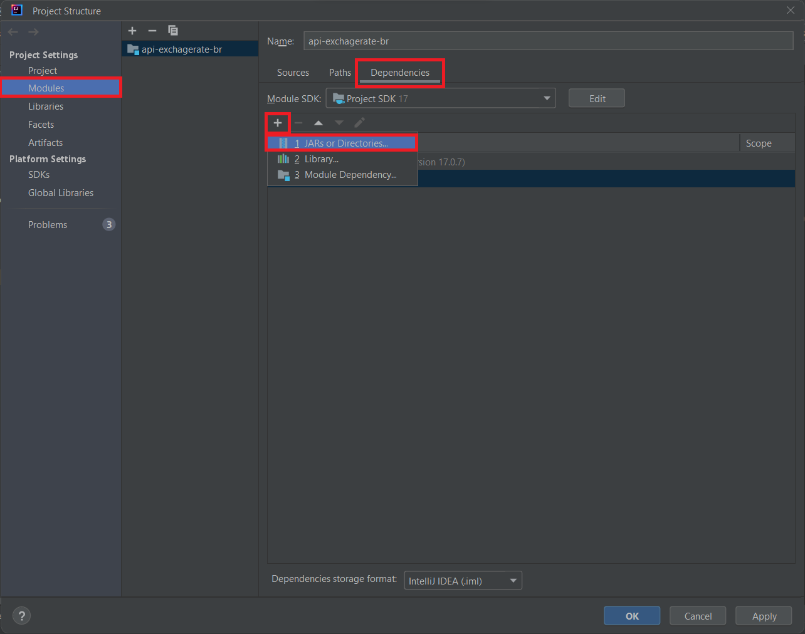
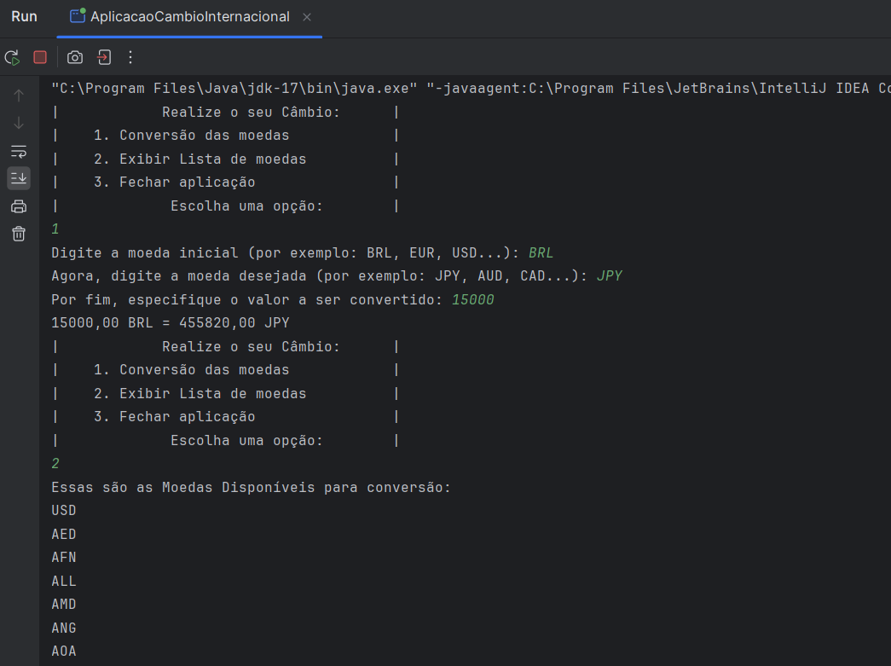

# Conversor de Moedas - Challenge ONE (Alura + Oracle)

Nesse projeto, o desafio era desenvolver uma aplicação que através do consumo de uma API, fosse possível fazer requisições da taxa de câmbio de diversos países em tempo real, manipulando dados JSON e, por fim, filtrar e exibir as moedas de interesse

**Para entender melhor sobre o funcionamento do projeto, basta baixar em sua máquina ou clonar o repositório e executá-lo a partir do arquivo "AplicacaoCambioInternacional"**

É possível que a aplicação talvez não funcione em sua máquina caso você não tenha a biblioteca "GSON"
- Para isso, basta apenas baixar a biblioteca no seguinte link: https://mvnrepository.com/artifact/com.google.code.gson/gson
- Dê preferência em baixar a versão mais recente possível
- Para adicionar o GSON no IntelliJ basta seguir os seguintes passos:

## Objetivo do Projeto:
- *Desenvolver um Conversor de Moedas que ofereça interação textual (via console) com os usuários, proporcionando no mínimo 6 opções distintas de conversões de moedas em um menu. A taxa de conversão não será estática, mas sim dinamicamente obtida por meio de uma API (Exchange-Rate API), garantindo dados precisos e em tempo real para uma experiência mais atualizada e eficaz.*

## Demonstração

## Badge de conclusão do Challenge ONE:

